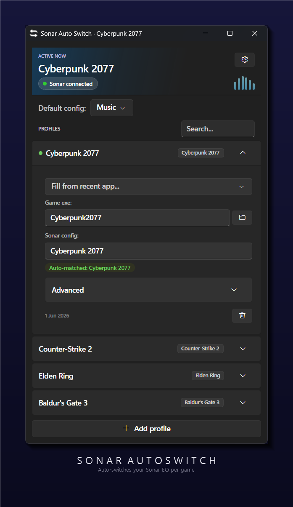

# Sonar.AutoSwitch, Continued

A continuation of [adirh3/Sonar.AutoSwitch](https://github.com/adirh3/Sonar.AutoSwitch).
Automatically switches your SteelSeries Sonar gaming audio profile when a game comes into focus.



## How to use

1. Download `Sonar.AutoSwitch.exe` from the [latest release](https://github.com/janikithup/SonarAutoSwitch-Continued/releases/latest).
2. Run it. It sits in the system tray. A status dot in the header shows the Sonar connection:
   green when connected, grey when idle, red when Sonar can't be reached.
3. Set a **Default config**, which applies when no game profile matches.
4. Add a profile per game using the **+** button. Click a profile to expand it and set the game's
   executable in one of three ways:
   - pick it from **Fill from recent app**, a list of windows the app has already seen,
   - **browse** to the `.exe` with the folder button, or
   - type the process name without `.exe` (it autocompletes from running processes).

   For games where the exe can't be read (e.g. Valorant), open **Advanced** and match on the
   **Window title** instead.
5. Switch to a game and Sonar switches with it. The active config is shown in the header and the
   window title.

## Build

Requires the .NET 8 SDK. (The released `.exe` is self-contained, so end users need nothing installed.)

```powershell
cd Sonar.AutoSwitch
dotnet publish -c Release -r win-x64 --self-contained true -p:PublishSingleFile=true
```
